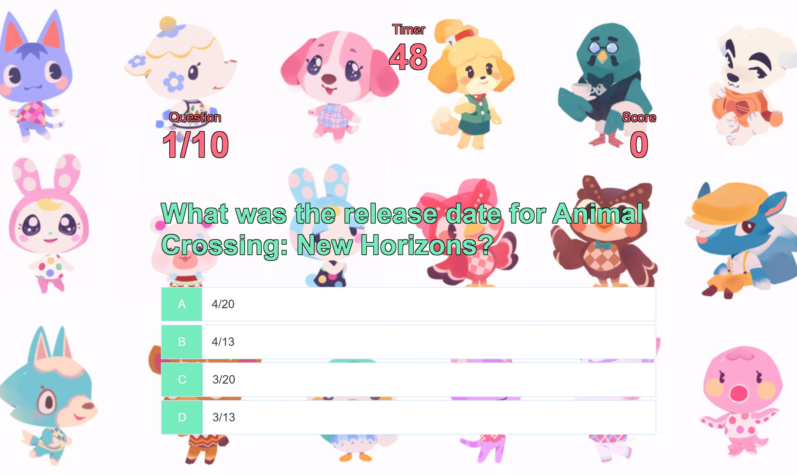

# Quiz Builder (Animal Crossing Quiz!)

## Table of Contents

[Description](#Description)

[Installation](#Installation)

[Usage](#Usage)

[Licenses](#Licenses)

[Contributors](#Contributors)

[Tests](#Tests)

[Questions](#Questions)

[Links](#Links)

[Screenshots](#Screenshots)

## Description

This is a javascript quiz that utilizes moment.js to keep track of time, JSON and local storage to store a list of high scores and users, and dynamic css to update classes based on correct/incorrect answers.  

## Installation

N/A

## Usage

N/A

## Licenses

N/A

## Contributors

- Matt Rikard

## Tests

N/A

## Questions

You may reach me at matthew.rikard@gmail.com for further questions.

## Links
Deployed page:
https://madhatter2084.github.io/quizbuilder/

## Screenshots

